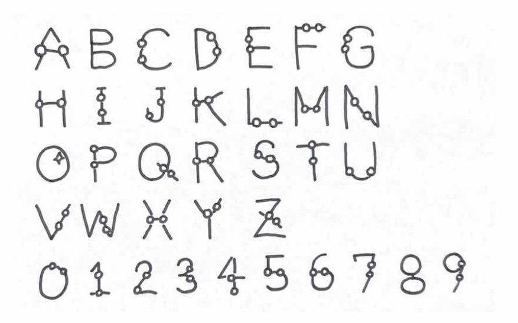

# sabae-font alpha 3

> 日本語のREADMEはこちらです: [README.ja.md](README.ja.md)

This project provides the "SABAE Font," a custom typeface created from SVG vector data. It is the realization of the grand prize-winning plan from the 18th Sabae City Revitalization Plan Contest.

- **Download Font:** [sabaefont-alpha3.ttf](https://code4fukui.github.io/sabae-font/sabaefont-alpha3.ttf)
- **Original Plan Details:** [SABAEフォント](https://code4fukui.github.io/sabaepc/#plan202506) (Japanese)





## How to Build from Source

This project uses [Deno](https://deno.land/) to build the font file from individual SVG glyphs located in the `src_split_svg/` directory.

**Requirements:**
- Deno runtime

**Build Command:**
To generate `sabaefont-alpha3.ttf` from the source SVGs, run the following command in your terminal:
```sh
deno run -A makeSabaeFont.js
```

## Project Workflow

The font is generated through a series of JavaScript modules that process SVG files:

1.  **SVG Glyphs**: Each character is defined in its own SVG file within the `src_split_svg/` directory.
2.  **Path Parsing**: `parsePathSVG.js` extracts the path data and `viewBox` from each SVG.
3.  **Path Conversion**: `svgPathToOpenTypePath.js` converts the SVG path strings into a format compatible with `opentype.js`.
4.  **Glyph Generation**: `svg2glyph.js` scales and positions the path data to create an OpenType glyph.
5.  **Font Assembly**: The main script, `makeSabaeFont.js`, orchestrates this process for all SVGs and uses `opentype.js` to assemble the final `.ttf` font file.

A unique utility, `addGlassesToSvgString.js`, can programmatically add a pair of glasses to any SVG character, celebrating Sabae's fame as a major producer of eyewear.

## Feedback and Requests

For any requests or feedback regarding the SABAE Font, please open an issue:
- [SABAEフォントに関するご要望 (Requests for SABAE Font)](https://github.com/code4fukui/sabae-font/issues/1)

## Tools and Attribution

- The SVG glyphs were created with the help of [SVGcode—Convert raster images to SVG vector graphics](https://svgco.de/).

## License

This project is licensed under the MIT License.